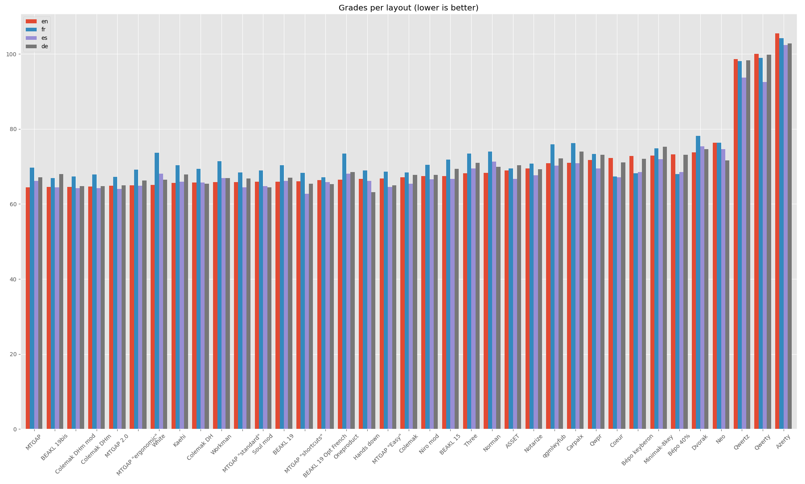
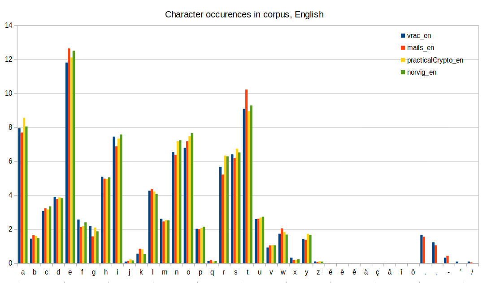
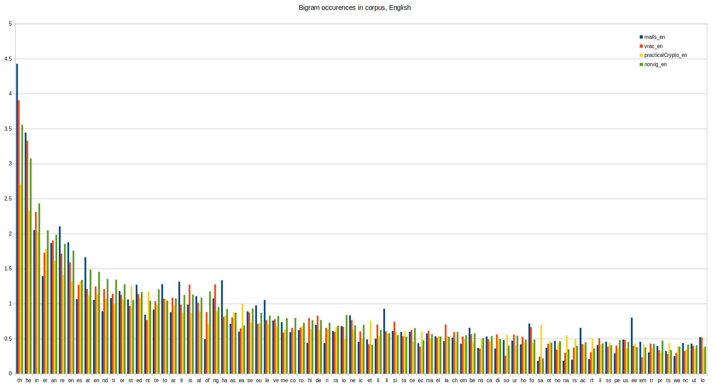
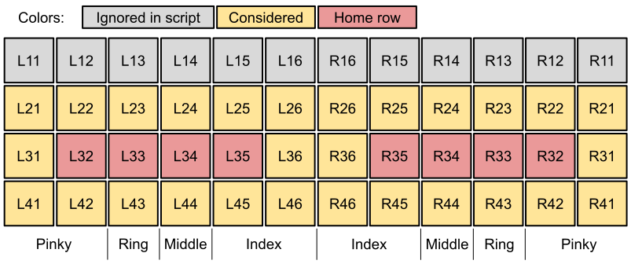
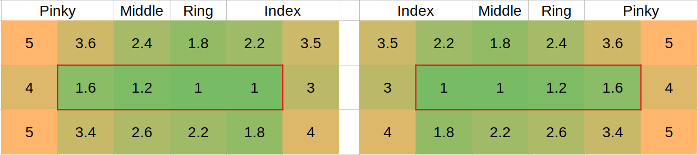
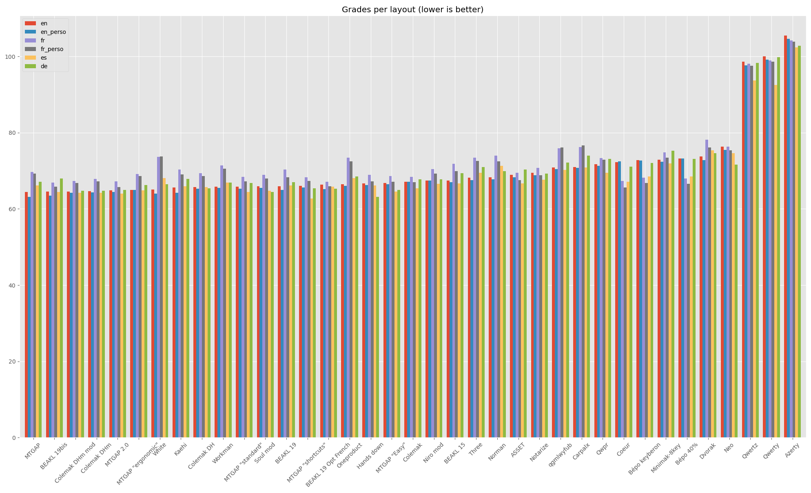
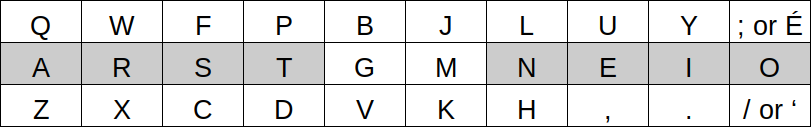

# Keyboard layout evaluation

An evaluation of existing keyboard layouts over multiple languages, focused on ergonomic keyboards.

Many keyboard layouts exist (designed by hand or generated by algorithm) to improve on the ergonomics of Qwerty. However, they are typically assessed for typing in a single language, and on a standard keyboard. This analysis evaluates those layouts over several languages, and for an ergonomic keyboard.

The method uses statistics of bigram use (sets of 2 letters) for each language, and grades them according to subjective "weights" (depending on the keys positions), to calculate a comparative difficulty between layouts.

It is focused on writing text, not code. Programming requires special characters most likely suited for an additional layer; this script focuses on the base layer. Also no attempt was made to generate a new "optimum" layout, as there would be a lot of variation depending on subjective parameters. Existing layouts already perform very well here, including some generated ones.

The results show that any alternative layout gives a significant ergonomic advantage over Qwerty. Several options give good results, in particular [Colemak DHm](https://colemakmods.github.io/mod-dh/keyboards.html) which also brings good familiarity, accessible shortcuts, and positive user feedback.

# Table of contents

- [Keyboard layout evaluation](#keyboard-layout-evaluation)
- [Table of contents](#table-of-contents)
- [Character statistics](#character-statistics)
  - [count.py](#countpy)
  - [Spreadsheet analysis](#spreadsheet-analysis)
    - [Character counts](#character-counts)
    - [Bigram counts](#bigram-counts)
  - [Punctuation](#punctuation)
  - [Takeaway](#takeaway)
- [Layout evaluation](#layout-evaluation)
  - [Focus definition](#focus-definition)
  - [Evaluation principle](#evaluation-principle)
    - [Key base weights](#key-base-weights)
    - [Penalties](#penalties)
  - [Limits](#limits)
    - [Bigram frequencies variations](#bigram-frequencies-variations)
    - [Accented characters](#accented-characters)
  - [script.py](#scriptpy)
  - [Results](#results)
- [Conclusion](#conclusion)

# Character statistics

Contained in folder `character_stats`.

The [layout evaluation](#layout-evaluation) needs bigram frequencies (sets of 2 letters) for each language.

The frequencies are sourced from [Practical Cryptography](http://practicalcryptography.com/cryptanalysis/letter-frequencies-various-languages/) for English, French, Spanish, and German; and from [Norvig](http://norvig.com/mayzner.html) for English (to compare).

For comparison my own corpus is also analyzed (for English and French); made of my emails, some texts from free books, and some internet articles.

## count.py

Requirements: Python 3, Pandas.

The script `count.py` takes the text files in the `data` folder and outputs the character counts in `chars.csv`, and the bigram counts in `bigrams.csv`. Upper case are converted to lower case.

The list of characters to take into account is configurable in the code, in the list `chars`. Currently it takes the basic alphabet, plus `éèêàçâîô.,-'/`. 

The provided `chars.csv` and `bigrams.csv` files were generated with a personal corpus of emails (`mails_en` and `mails_fr`, 300\~400kB of raw text each) and various free books and articles (`vrac_en` and `vrac_fr`, 200\~400kB each).

## Spreadsheet analysis

This analysis is done in the Libreoffice spreadsheet `stats.ods`.

### Character counts

The characters frequencies for both English and French are quite consistent between the sources and my own corpus.

[Here](images/chars_fr.png) is the same chart for French.

### Bigram counts

The bigram counts show more discrepancies however. The charts below show the top 80 bigrams (sorted by average of both sources for English).

[Here](images/bigram_fr.png) is the same chart for French.

## Punctuation

The "theory" numbers from Practical Cryptography and Norvig do not contain data on punctuation characters such as `.,-'/`. However while the use of `.` and `,` depend a lot on each author's style, taking into account a non-zero frequency is essential due to their frequency.

The relevant bigram frequencies are not present in any existing statistics, but for French [the Bépo layout project](https://bepo.fr/wiki/Fr%C3%A9quence_des_caract%C3%A8res) gives character frequencies from a Wikipedia 2008 dump.

For English, [Vivian Cook's analysis](http://www.viviancook.uk/Punctuation/PunctFigs.htm) gives frequencies by word. [This University of Maryland paper](http://www.cs.umd.edu/hcil/trs/2013-17/2013-17.pdf) (Table 1) gives a frequency for the period of 1.151% (from Google Ngram data).

The frequencies from the personal corpus contain those characters so it can be used as a control. However it is useful to have more realistic "theory" results. The approach is to "fix" the missing frequencies by copying the relevant ones from the personal corpus, and normalizing the column.

To check that those inputs make sense, they can be compared to the few data available.

For English, we can estimate by dividing the frequencies from Vivian Cook by the average word length of 4.79 letters (from Norvig).

| For English | Personal corpus | Frequency / Word length | Google Ngram |
| :---------- | --------------: | ----------------------: | -----------: |
| Period .    |           1.6 % |                  1.36 % |      1.151 % |
| Comma ,     |           1.2 % |                  1.29 % |              |

| For French | Personal corpus | Wikipedia dump |
| :--------- | --------------: | -------------: |
| Period .   |           1.2 % |         0.83 % |
| Comma ,    |           1.5 % |         1.02 % |

Obviously some variation can be observed, but the numbers from the personal corpus pass that sanity check. It seems a bit more punctuation is used compared to the average literature, which isn't bad to consider.

## Takeaway

For the evaluation, the "theory" numbers will be the average from both sources for English, and the only source I have for other languages. But the differences with my own corpus show the sensitivity of those inputs, therefore the results should be taken with some tolerance.

As the "theory" numbers do not contain characters such as `.,-'/`, those will be copied from the personal corpus data then normalized.

# Layout evaluation

Contained in folder `layout_evaluation`.

## Focus definition

The influence of the physical keyboard is on the weights and penalties. The algorithm is more or less the same otherwise.

The chosen weights are for an ergonomic keyboard, which is why they are symmetrical. It would be similar for any non-staggered keyboard (meaning no horizontal shift between rows).

Only the keys on the main "matrix" are taken into account (3×12 matrix), which are reachable by a finger easily. The "numbers" row is ignored as we focus on the alphabetical layout.

Thumb keys available on ergonomic keyboards are ignored as I arbitrarily prefer not to place any alphanumeric character on them.

The keys are designated by a code (hand, row, column). The numbering includes space for some keys unused in the current script, in case of evolution (for instance for [keys on an Ergodox-like keyboard](images/layout_ergodox.svg)).

## Evaluation principle

For each language, the bigram frequencies are imported from the characters statistics, as percentage of use.

The principle is to assign a difficulty (weight) to a bigram (two keys typed consecutively). This weight can be multiplied by the bigram frequency, and all the bigram results summed up to get a general difficulty value of the layout.

Weightlayout = sum( Weightbigram × Probabilitybigram )

The bigram weight is composed of:
- The weights assigned to the two key, representing the relative difficulty to push them
- A penalty, representing the added difficulty of pushing those 2 keys one after the other.

Weightbigram = Weightkey1 + Weightkey2 + Penaltykey1 & key2

The results for all layouts and languages are finally normalized compared to Qwerty in English (at 100%).

### Key base weights

The base weights are shown below. The home row is identified in red border. 

They represent the relative difficulty to hit a single key. The proposed values are for an ergonomic keyboard, with vertical columns and a comfortable home row position.

### Penalties

The penalties represent the additional difficulty of to hitting 2 keys consecutively. They come on top of the base weight. They are only taken into account if the 2 keys are hit by the same hand (and are not the same key, like "aa"). By default they are given a slightly positive value in order to favor hand alternation.

Generally the penalties are higher if the same finger is used, and also the more rows separate the 2 keys. They can be negative if the relative position makes the motion easy, such as a close "inward roll" (like "sd" on Qwerty).

| First finger | Second finger | Same row | 1 row jump | 2 rows jump | Comment     |
| :----------- | :------------ | -------: | ---------: | ----------: | :---------- |
| Index        | Index         |      2.5 |        3.5 |         4.5 | Same finger |
| Index        | Middle        |      0.5 |        1.0 |         2.0 |
| Index        | Ring          |      0.5 |        0.8 |         1.5 |
| Index        | Pinky         |      0.5 |        0.8 |         1.1 |
| Middle       | Index         |     -1.5 |       -0.5 |         1.5 | Inward roll |
| Middle       | Middle        |      N/A |        3.5 |         4.5 | Same finger |
| Middle       | Ring          |      0.5 |        1.0 |         2.0 |
| Middle       | Pinky         |      0.5 |        0.8 |         1.5 |
| Ring         | Index         |     -1.5 |       -0.5 |         1.5 | Inward roll |
| Ring         | Middle        |     -2.0 |       -0.5 |         1.2 | Inward roll |
| Ring         | Ring          |      N/A |        3.5 |         4.5 | Same finger |
| Ring         | Pinky         |      1.0 |        1.5 |         2.5 |
| Pinky        | Index         |     -1.0 |        0.0 |         1.0 | Inward roll |
| Pinky        | Middle        |     -1.0 |        0.0 |         1.5 | Inward roll |
| Pinky        | Ring          |     -1.0 |        0.0 |         1.5 | Inward roll |
| Pinky        | Pinky         |      3.0 |        4.0 |         5.5 | Same finger |

## Limits

### Bigram frequencies variations

As stated in the character statistics, the results are approximate as the bigram frequencies aren't a precise and objective number for everyone. 

However the results for [English](images/results_en.png) and [French](images/results_fr.png) show very little difference between the "theory" values and my personal corpus. Therefore it seems the variation in bigram use doesn't affect the final grade very significantly.

### Accented characters

The results for languages outside English are slightly off because most accented characters are not taken into account. 

Currently the ignored characters are `êàçâîôñäöüß/`, mainly because those characters are absent from most considered layouts. The characters `é` and `è` were added manually to the layouts (on unused keys, on vowel side if there's one) because I particularly care about French, and due to their high frequency (2.85%).

The characters `'` and `-` were also added when missing, on unused keys.

The issue mainly affects German (`äöüß`, 1.56% of the characters), but also French (`êàçâîô`, 0.75%) and Spanish (`ñ`, 0.22%).

To mitigate this effect the bigram frequencies are normalized after removing the ignored characters, so the summed grade is still calculated over 100%.

## script.py

Requirements: Python 3, Pandas, Matplotlib.

The script `script.py` uses the bigram statistics from `stats.csv`, and the configuration (key weights, penalties, and layouts definitions) from `config.txt` to generate the results (table and plot).

To customize the script, edit `config.txt` and have a look at the `main()` function.

The code isn't very efficient as it iterates through dataframes to generate the results. It executes in \~10s so in practice it doesn't really matter.

## Results

Here are the full results, for all 4 languages and including my personal corpus for English and French.

In addition, here are the results for [only English](images/results_en.png) and [only French](images/results_fr.png). For comparison this includes the results before adding the punctuation as described [earlier](#punctuation). The necessity of taking into account the punctuation is clear. Both the "theory" and personal corpus give very similar grades, so results are quite consistent.

Here is the complete results list. The layouts can be seen in `config.txt`.

| Layout                                                                                                                                        | English | English perso | French | French perso | Spanish | German |
| :-------------------------------------------------------------------------------------------------------------------------------------------- | ------: | ------------: | -----: | -----------: | ------: | -----: |
| [MTGAP](https://mathematicalmulticore.wordpress.com/the-keyboard-layout-project/)                                                             |   64.48 |         63.17 |  69.73 |        69.20 |   66.14 |  67.15 |
| [BEAKL 19bis](https://www.reddit.com/r/ErgoDoxEZ/comments/gsvpug/layout_of_the_month_beakl_15/ftcan68/?context=3)                             |   64.51 |         63.47 |  66.87 |        65.81 |   64.45 |  67.92 |
| Colemak DHm mod                                                                                                                               |   64.54 |         64.18 |  67.32 |        66.75 |   64.18 |  64.70 |
| [Colemak DHm](https://colemakmods.github.io/mod-dh/keyboards.html)                                                                            |   64.66 |         64.31 |  67.88 |        67.21 |   64.18 |  64.70 |
| [MTGAP 2.0](https://mathematicalmulticore.wordpress.com/2010/06/21/mtgaps-keyboard-layout-2-0/)                                               |   64.91 |         64.44 |  67.21 |        65.77 |   64.01 |  64.98 |
| [MTGAP "ergonomic"](http://mtgap.bilfo.com/official_keyboard.html)                                                                            |   64.99 |         64.96 |  69.18 |        68.63 |   64.81 |  66.23 |
| [White](https://github.com/mw8/white_keyboard_layout)                                                                                         |   65.10 |         64.00 |  73.60 |        73.76 |   68.09 |  66.50 |
| [Kaehi](https://geekhack.org/index.php?topic=98275.0)                                                                                         |   65.56 |         64.18 |  70.35 |        69.09 |   65.92 |  67.83 |
| [Colemak DH](https://colemakmods.github.io/mod-dh/)                                                                                           |   65.71 |         65.29 |  69.32 |        68.64 |   65.67 |  65.43 |
| [Workman](https://workmanlayout.org/)                                                                                                         |   65.83 |         65.51 |  71.42 |        70.57 |   66.85 |  66.93 |
| [MTGAP "standard"](http://mtgap.bilfo.com/official_keyboard.html)                                                                             |   65.84 |         65.24 |  68.35 |        67.27 |   64.43 |  66.78 |
| [Soul mod](http://kennetchaz.github.io/symmetric-typing/soul.html)                                                                            |   65.89 |         65.53 |  68.96 |        68.00 |   64.71 |  64.38 |
| [BEAKL 19](https://www.reddit.com/r/ErgoDoxEZ/comments/gsvpug/layout_of_the_month_beakl_15/fsc1t3y/?context=3)                                |   65.98 |         65.00 |  70.36 |        68.28 |   66.12 |  66.99 |
| [MTGAP "shortcuts"](http://mtgap.bilfo.com/official_keyboard.html) (ROTS)                                                                     |   66.02 |         65.59 |  68.24 |        67.30 |   62.72 |  65.44 |
| [BEAKL 19 Opt French](https://www.reddit.com/r/ErgoMechKeyboards/comments/j1eopm/hands_down_layout_is_ready_for_daily_use/g7bjmr7/?context=3) |   66.32 |         65.23 |  67.12 |        65.96 |   65.85 |  65.31 |
| [Oneproduct](https://geekhack.org/index.php?topic=67604.0)                                                                                    |   66.44 |         66.07 |  73.48 |        72.44 |   68.07 |  68.45 |
| [Hands down](https://sites.google.com/alanreiser.com/handsdown)                                                                               |   66.64 |         66.20 |  68.97 |        67.21 |   66.10 |  63.14 |
| [MTGAP "Easy"](http://mtgap.bilfo.com/official_keyboard.html)                                                                                 |   66.78 |         66.44 |  68.63 |        67.15 |   64.55 |  64.97 |
| [Colemak](https://colemak.com/)                                                                                                               |   67.15 |         67.08 |  68.40 |        67.00 |   65.37 |  67.77 |
| [Niro mod](http://kennetchaz.github.io/symmetric-typing/niro.html)                                                                            |   67.41 |         67.39 |  70.47 |        69.30 |   66.58 |  67.71 |
| [BEAKL 15](https://deskthority.net/wiki/BEAKL)                                                                                                |   67.43 |         66.98 |  71.86 |        69.85 |   66.64 |  69.37 |
| [Three](https://github.com/jackrosenthal/threelayout)                                                                                         |   68.23 |         67.51 |  73.43 |        72.53 |   69.46 |  71.00 |
| [Norman](https://normanlayout.info/)                                                                                                          |   68.34 |         67.74 |  74.01 |        72.48 |   71.24 |  69.86 |
| [ASSET](http://millikeys.sourceforge.net/asset/)                                                                                              |   68.88 |         68.29 |  69.42 |        67.53 |   66.69 |  70.35 |
| [Notarize](https://sites.google.com/alanreiser.com/handsdown)                                                                                 |   69.45 |         68.83 |  70.76 |        68.81 |   67.68 |  69.21 |
| [qgmlwyfub](http://mkweb.bcgsc.ca/carpalx/?full_optimization)                                                                                 |   70.83 |         70.39 |  75.87 |        76.11 |   70.24 |  72.16 |
| [Carpalx](http://mkweb.bcgsc.ca/carpalx/?full_optimization)                                                                                   |   71.02 |         70.70 |  76.25 |        76.62 |   70.86 |  74.00 |
| [Qwpr](https://sourceforge.net/projects/qwpr/)                                                                                                |   71.69 |         71.30 |  73.36 |        72.93 |   69.44 |  73.07 |
| [Coeur](https://bepo.fr/wiki/Utilisateur:Bibidibop)                                                                                           |   72.29 |         72.46 |  67.35 |        65.66 |   67.07 |  71.04 |
| [Bépo keyberon](https://github.com/TeXitoi/keyberon#whats-the-layout)                                                                         |   72.79 |         72.71 |  68.15 |        66.78 |   68.53 |  72.07 |
| [Minimak-8key](http://www.minimak.org/)                                                                                                       |   72.94 |         72.37 |  74.81 |        73.48 |   71.94 |  75.20 |
| [Bépo 40%](http://forum.bepo.fr/viewtopic.php?id=1131)                                                                                        |   73.20 |         73.19 |  67.97 |        66.61 |   68.54 |  73.10 |
| [Dvorak](https://en.wikipedia.org/wiki/Dvorak_keyboard_layout)                                                                                |   73.74 |         72.79 |  78.15 |        76.07 |   75.34 |  74.59 |
| [Neo](https://neo-layout.org/)                                                                                                                |   76.31 |         75.50 |  76.37 |        75.37 |   74.56 |  71.62 |
| Qwertz                                                                                                                                        |   98.56 |         97.63 |  98.12 |        97.59 |   93.66 |  98.31 |
| Qwerty                                                                                                                                        |  100.00 |         99.17 |  98.90 |        98.64 |   92.45 |  99.74 |
| Azerty                                                                                                                                        |  105.44 |        104.64 | 104.18 |       103.88 |  102.40 | 102.81 |

As the "Colemak DHm" layout gave the most interesting results, a personal modified version was added to replace some characters like `;` (that can be on a layer like Shift + `,`) by the French `é`.

# Conclusion

All the alternative layouts perform very significantly better than the traditional ones (Qwerty and similar). The biggest interest for ergonomics is using an alternative layout at all, the selected choice matters a lot less.

The options that perform the best are some Colemak variants like DHm, the obscure [BEAKL 19bis](https://www.reddit.com/r/ErgoDoxEZ/comments/gsvpug/layout_of_the_month_beakl_15/ftcan68/?context=3), as well as the layouts generated by [Mathematical multicore](https://mathematicalmulticore.wordpress.com/) (MTGAP). Colemak DHm (below) gives very good results without compromising any of the 4 languages, which makes sense as it stems from user feedback on ergonomic keyboards.

In conclusion, the Colemak DHm layout is particularly recommended for its good results and better shortcuts access, familiarity with Qwerty, and larger positive user feedback.